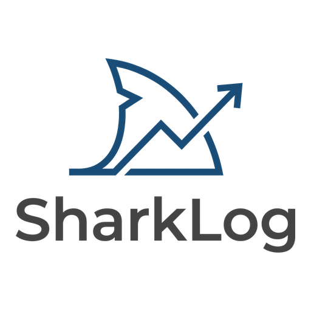

# 🦈 SharkLog — Дневник ставок

<p align="center">
  
</p>

<p align="center">
  Профессиональный трекер ставок для рынка СНГ.<br/>
  Мобильное приложение (iOS + Android) и десктоп (Windows / macOS / Linux).<br/>
  <strong>Freemium:</strong> бесплатно до 50 ставок · Pro 199 ₽/мес или 990 ₽/год
</p>

<p align="center">
  <a href="https://hoxitoo.github.io/Sharklog/">Лендинг</a> ·
  <a href="https://hoxitoo.github.io/Sharklog/privacy.html">Политика конфиденциальности</a>
</p>

---

## Возможности

| Функция | Free | Pro |
|---------|:----:|:---:|
| Учёт ставок (до 50) | ✅ | ✅ |
| Неограниченные ставки | — | ✅ |
| Аналитика (7 срезов) | — | ✅ |
| Инсайты по командам (≥10 ставок) | — | ✅ |
| Банкролл + кривая капитала | — | ✅ |
| Калькулятор Келли | — | ✅ |
| Дневной лимит ставок | — | ✅ |
| Тилт-алерт | ✅ (фикс. 3) | ✅ (настраиваемый) |
| Дневник + трекер настроения | ✅ | ✅ |
| Инсайты по турнирам | ✅ | ✅ |
| Билдер стратегий | — | ✅ |
| Импорт CSV / Excel | ✅ | ✅ |
| Экспорт CSV / JSON | ✅ | ✅ |
| 5 статусов ставки | ✅ | ✅ |
| Автообновления (десктоп) | ✅ | ✅ |

**5 статусов:** Ожидание / Победа / Поражение / Возврат (букмекер вернул) / Выкуп (кешаут)

---

## Структура монорепо

```
apps/
  mobile/     — React Native + Expo 51  (iOS + Android)
  desktop/    — Tauri v2 + React + Vite (Win / Mac / Linux)
packages/
  core/       — TypeScript бизнес-логика (типы, статистика, Kelly, форматтеры, стратегии)
docs/         — ROADMAP.md, PRIVACY_POLICY.md
```

---

## Быстрый старт

### Требования

- Node.js 20+
- npm 10+
- Для нативной Tauri-сборки: Rust 1.77+ ([rustup.rs](https://rustup.rs))
- Для мобилки: [Expo CLI](https://docs.expo.dev/get-started/installation/) и Android Studio / Xcode

### Установка

```bash
npm install
```

### Запуск

```bash
# Мобилка — Expo Dev Server
cd apps/mobile && npx expo start

# Десктоп — браузер (localhost:1420)
cd apps/desktop && npm run dev

# Десктоп — нативное окно Tauri (требует Rust)
cd apps/desktop && npx tauri dev
```

### Тесты

```bash
cd packages/core && npx vitest run       # 12 unit-тестов
cd apps/desktop  && npm test             # 40 smoke-тестов
cd apps/desktop  && npx playwright test  # 22 E2E-тестов
cd apps/mobile   && npm test             # 17 smoke-тестов
```

### Проверка типов

```bash
cd apps/desktop && npx tsc --noEmit
cd apps/mobile  && npx tsc --noEmit
```

---

## Сборка и релиз

### Desktop — нативный инсталлер

```bash
cd apps/desktop && npx tauri build
# Windows → src-tauri/target/release/bundle/msi/*.msi
# macOS   → src-tauri/target/release/bundle/dmg/*.dmg
# Linux   → src-tauri/target/release/bundle/appimage/*.AppImage
```

Первая сборка ~10–15 минут (компиляция Rust). Последующие быстрее.

### Desktop — автоматический релиз через GitHub Actions

Создай тег вида `v1.0.0` — CI автоматически соберёт инсталлеры для всех трёх платформ и опубликует GitHub Release:

```bash
git tag v1.0.0 && git push origin v1.0.0
```

> Подробная инструкция: [`docs/RELEASE_GUIDE.md`](docs/RELEASE_GUIDE.md)

### Mobile — EAS Build

```bash
# Android APK / AAB
eas build -p android --profile production

# iOS IPA
eas build -p ios --profile production

# Публикация в сторы
eas submit -p android
eas submit -p ios
```

Или запусти вручную через GitHub Actions → **EAS Build** workflow.

---

## Технологии

| | Мобилка | Десктоп |
|-|---------|---------|
| Фреймворк | React Native + Expo 51 | Tauri v2 + React 18 |
| Состояние | Zustand + AsyncStorage | Zustand + SQLite / localStorage |
| Графики | react-native-gifted-charts | Recharts |
| Шрифты | DM Sans + DM Mono | DM Sans + DM Mono |
| Оплата | RevenueCat | — (планируется LemonSqueezy) |
| Обновления | EAS OTA | Tauri updater (подписанные, GitHub Releases) |
| Тесты | Jest (17 smoke) | Vitest (40 smoke) + Playwright (22 E2E) |
| Язык | TypeScript strict | TypeScript strict |

---

## Локализация

SharkLog поддерживает **4 языка**: 🇷🇺 Русский · 🇬🇧 English · 🇰🇿 Қазақша · 🇧🇾 Беларуская

Язык выбирается в разделе **Настройки → Язык** с помощью флаг-чипов. Выбор сохраняется в хранилище приложения.

Файлы переводов: `apps/desktop/src/i18n/locales/` и `apps/mobile/src/i18n/locales/`

---

## Ключевые соглашения

- **Деньги в копейках** — все суммы хранятся как `integer`. `1000 ₽ = 100_000 коп.`  
  `formatMoney(kopecks)` — для отображения, `parseMoneyInput(str)` — для парсинга ввода.  
  На мобилке: `useFormatMoney()` — учитывает `settings.roundAmounts`.

- **UUID v4** для всех ID. Никогда не `Date.now()`.

- **refund ≠ cashout**: `refund` — букмекер вернул ставку (отмена матча); `cashout` — игрок выкупил сам.

- **PRO-гейт**: `canAddBet()` в стор, `<ProGate>` на мобилке — не обходить.

- **`exactOptionalPropertyTypes: true`**: писать `{...(x ? { prop: x } : {})}`, не `prop={undefined}`.

- **`formatPercent()`** уже добавляет `+` для положительных — не добавлять вручную.

---

## Цветовая система

| Цвет | HEX | Назначение |
|------|-----|-----------|
| Teal | `#22D3A0` | Победы, положительные значения, акцент |
| Purple | `#5B6AF0` | CTA-кнопки, активные состояния |
| Red | `#F4455A` | Поражения, отрицательные значения |
| Gold | `#F59E0B` | Ожидающие ставки, PRO-бейдж |
| Violet | `#A78BFA` | Возвраты, кешаут |

---

## Переменные окружения

**Desktop** — `apps/desktop/.env.local` (в .gitignore):
```env
VITE_OWNER_PRO=true   # Pro без покупки (owner-режим)
```

**Mobile** — через EAS Secrets или `.env.local`:
```env
EXPO_PUBLIC_RC_IOS_KEY=...
EXPO_PUBLIC_RC_ANDROID_KEY=...
EXPO_PUBLIC_ENV=production
```

---

## CI/CD

| Workflow | Триггер | Что делает |
|----------|---------|-----------|
| `ci.yml` | push / PR → main | unit-тесты, E2E, tsc |
| `release-desktop.yml` | тег `v*` | сборка Win/Mac/Linux инсталлеров + GitHub Release |
| `eas-build.yml` | вручную | EAS Build для Android / iOS |

---

## Git-ветки

| Ветка | Назначение |
|-------|-----------|
| `main` | Продакшен — только через PR, CI должен быть зелёным |
| `dev` | Интеграционная — PR из feature-веток сюда перед main |
| `claude/busy-shannon-jQgRK` | Активная разработка (Claude AI sandbox) |
| `gh-pages` | Лендинг-страница [hoxitoo.github.io/Sharklog](https://hoxitoo.github.io/Sharklog/) |

**Никогда не пушить напрямую в `main`.**

---

## Лицензия

Proprietary — все права защищены.
